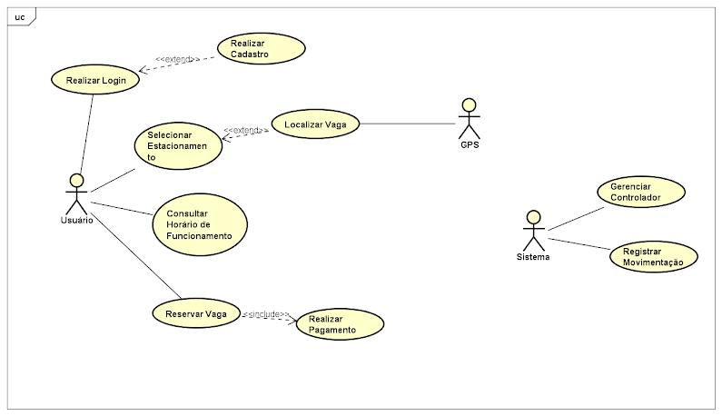

# Estacionamento Inteligente 

Atividade da disciplina Análise e Projeto de Sistemas em que  foi proposto pela profª [Aida Araújo Ferreira](http://buscatextual.cnpq.br/buscatextual/visualizacv.do?id=K4776702E0) uma situação-problema, bem como sua solução, afim de que sejam elaborados o diagrama UML de Caso de Uso, o Modelo Relacional e o BD MySQL.

## As ferramentas 

Para geração do diagrama UML foi utilziado o [Astah UML](http://astah.net/) e para o Modelo Relacional e código do BD foram utilizados o [Workbenck 8.0 CE](https://dev.mysql.com/downloads/workbench/).

## O problema dos estacionamentos

Atualmente, encontrar uma vaga de estacionamento em centros urbanos é um grande problema devido a aglomeração humana e, consequentemente, a quantidade de automóveis em circulação. Mesmo em grandes centros, onde existem bolsões de estacionamento, não existe sinalização clara e eficaz dos locais onde se encontram as vagas fisicamente disponíveis em muitos estacionamentos. A solução atual são luzes indicativas (verdes/vermelhas) que, internas ao estacionamento, caracterizam respectivamente, os locais das vagas de estacionamento livres ou ocupadas. Esse modelo não permite que os usuários tenham noção antecipada das vagas disponíveis antes de entrarem fisicamente com seus automóveis nos mesmos. Também não existem sistemas para o auxílio na busca por vagas disponíveis. Um motorista pode chegar a gastar vários minutos no esforço de encontrar um local para estacionar seu automóvel.

## A solução - Sistema de Estacionamento Inteligente

Para resolver este problema, surgiu a ideia de criar-se um sistema que possa facilitar a vida dos motoristas: As informações sobre o estado da vaga serão enviadas através de uma rede sem fio a um servidor, que faz o processamento das informações e armazena as mesmas em um banco de dados para disponibilização aos usuários através de um sistema de informação geográfica (SIG). O SIG será responsável pelo gerenciamento da rede de sensores de vagas disponíveis para visualização na WEB ou em dispositivos móveis da configuração espacial da disponibilidade de vagas no estacionamento.

## Diagrama de Caso de Uso

### Atores

* Usuário 
* Sistema 
* GPS

### Casos de uso

* Realizar cadastro
* Realizar login
* Selecionar estacionamento
* Localizar vaga
* Consultar horário de funcionamento
* Reservar vaga
* Realizar pagamento
* Gerenciar controlador
* Registrar movimentação

## Modelo Relacional

